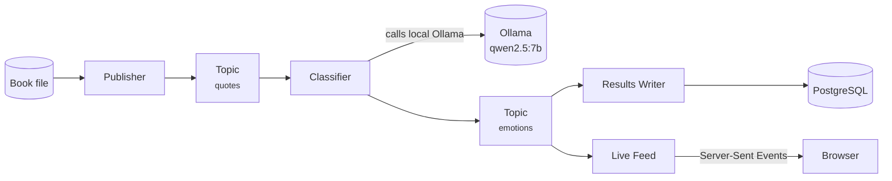

# Kafka-on-Kafka

## Overview

The goal is to put the core Kafka concepts into practice — producers, consumers, topics, partitions, consumer groups, offsets and lag — with a small but complete pipeline.

A publisher sends excerpts from *The Metamorphosis*, one at a time with a delay between them, simulating a continuous stream. A consumer reads each excerpt and sends it to a local LLM (Ollama, `qwen2.5:7b`), which classifies the excerpt's emotional tone (anxiety, absurdity, resignation, alienation, bureaucracy, despair, confusion). The result is published to a second topic, then stored and shown live on a small real-time frontend.

It is a single Spring Boot application using Spring Kafka, organized with hexagonal architecture (ports and adapters).

## Scope

**In scope:**

- Book: *The Metamorphosis*, public-domain English translation (Project Gutenberg)
- Data and code language: English
- Java 21 (LTS), using `record` for data models
- One Spring Boot application, one Maven module, hexagonal architecture
- Book-agnostic text source: `book-config.json` defines the book's text file, where it starts and ends, how sections are detected and how it is chunked — switching books requires no code changes (the 8 emotion categories are fixed and tuned for Kafka's themes)
- Two Kafka topics: one for raw excerpts, one for classified results
- Results stored in PostgreSQL
- Simple, real-time frontend (HTML/JS + Server-Sent Events) showing classifications as they happen
- Fully local execution, everything orchestrated via Docker Compose (Kafka, Postgres, Ollama and the application)

**Out of scope (for now):**

- Other books by Franz Kafka (*The Trial*, *The Castle*) — the pipeline supports them through `book-config.json`, but they're not part of this first version
- Authentication/authorization on the frontend
- Kafka Streams or Kafka Connect (a possible next step)
- Multi-broker / a real Kafka cluster

## Architecture



**Flow:** at startup, the publisher reads the book's text file and `book-config.json`, splits the text into paragraphs and publishes them one at a time to `quotes` (by default every 3 seconds). The classifier reads that topic one message at a time, calls Ollama's HTTP API to classify the excerpt's emotional tone, and publishes the result to `emotions`. Two independent consumers then read that second topic, each in its own consumer group: the results writer saves the result to PostgreSQL, and the live feed streams it to the browser in real time via Server-Sent Events.

All of this runs inside one application, but the pieces stay decoupled by Kafka: the publisher never waits for the classifier. If the model is slower than the publisher, excerpts pile up in the `quotes` topic (consumer lag) and the classifier catches up later — nothing is lost.

### Hexagonal layout

The packages follow the hexagonal layout: what the app *is* (`domain`), what it *does* (`application`), and what talks to the outside world (`adapter`).

| Package | Contents |
| --- | --- |
| `domain` | `Quote`, `EmotionResult`, `Emotion` — plain Java, no framework |
| `application` | The use cases: publish the book, classify a quote, save a result, keep the live feed state |
| `adapter.in.kafka` | Listeners that receive messages from the topics and call the use cases |
| `adapter.in.web` | The SSE endpoint, `/stats`, and the startup trigger of the publisher |
| `adapter.out.*` | Everything that reaches out: Kafka publishers, the Ollama classifier, JPA persistence, the book file reader |

Classes call each other directly: **no interface is created until there is a second implementation** (for example, a second classifier besides Ollama). Tests simulate a class with Mockito instead of a hand-written interface.

## Tech Stack

| Component | Technology | Role |
| --- | --- | --- |
| Language | Java 21 (LTS) | Everything |
| Build | Maven (single module) | Dependency management and build |
| Framework | Spring Boot 4.1 | Application, configuration, web |
| Kafka client | Spring Kafka (`@KafkaListener`, `KafkaTemplate`) | Publishing and consuming |
| Persistence | Spring Data JPA + PostgreSQL | Stores classified results |
| LLM client | Spring `RestClient` | Calls Ollama |
| Live updates | Spring Web (`SseEmitter`) | Streams results to the browser |
| Serialization | Jackson | Java objects <-> JSON |
| Kafka broker | Docker Compose (KRaft mode) | Local Kafka, no Zookeeper |
| Local LLM | Ollama + `qwen2.5:7b` | Emotional-tone classification |
| Orchestration | Docker Compose | Brings up everything with one command |

## Book Configuration

The publisher reads `data/book-config.json` and the text file it points to:

```json
{
  "title": "The Metamorphosis",
  "file": "metamorphosis.txt",
  "startMarker": "*** START OF THE PROJECT GUTENBERG EBOOK",
  "endMarker": "*** END OF THE PROJECT GUTENBERG EBOOK",
  "sectionPattern": "^(I|II|III)$",
  "chunking": "paragraph",
  "minLength": 40
}
```

At startup the publisher:

1. Drops everything before `startMarker` and after `endMarker` (the Gutenberg header and license).
2. Splits the rest into paragraphs (blank-line separated) and discards the ones shorter than `minLength`.
3. Sets each excerpt's `part` to the last line matching `sectionPattern` (`null` if the book has no sections).
4. Assigns sequential ids (`q-0001`, `q-0002`, ...).

## LLM Integration

**Endpoint:** `POST http://ollama:11434/api/generate` (Ollama's API, reached by service name inside the Docker network)

**Request (example):**

```json
{
  "model": "qwen2.5:7b",
  "prompt": "Classify the emotional tone of this excerpt in exactly one word from this list: anxiety, absurdity, resignation, alienation, bureaucracy, despair, confusion. Respond with only the word.\n\nExcerpt: \"<excerpt text>\"",
  "stream": false
}
```

**Response (example):**

```json
{
  "model": "qwen2.5:7b",
  "response": "alienation",
  "done": true
}
```

**Emotion categories** (a Java `enum Emotion` in the `domain` package, stored as text in the database):

- anxiety
- absurdity
- resignation
- alienation
- bureaucracy
- despair
- confusion
- unknown — fallback, never sent in the prompt

**Handling the response:** the classifier extracts the `response` field, then normalizes it (trim, lowercase, strip punctuation, keep the first word). If the result isn't one of the seven categories, the emotion is `unknown`. If the Ollama call fails (timeout or HTTP error), it retries 3 times and then also falls back to `unknown`, so one bad excerpt never blocks the topic.

The classification is attached to the original excerpt before publishing to `emotions`.

## Kafka Setup

| Topic | Partitions | Key | Notes |
| --- | --- | --- | --- |
| `quotes` | 3 | `part` | Excerpts of the same part keep their order |
| `emotions` | 3 | `part` | `retention.ms=-1` so the live feed can replay it from the start |

Topics are created by the `kafka-init` container in Docker Compose.

| Consumer group | Listener | Reads |
| --- | --- | --- |
| `classifier` | classifier | `quotes` |
| `results-writer` | results writer | `emotions` |
| `frontend` | live feed | `emotions` |

- **Partitioning:** a book has few parts (3 for *The Metamorphosis*), so there are only 3 distinct keys. Kafka hashes the key to pick the partition, so two parts may land on the same partition and one partition may stay empty.
- **Scaling the classifier:** run more instances of the application and the `classifier` group splits the 3 partitions among them. Extra instances should run with `APP_PUBLISHER_ENABLED=false`, otherwise each one publishes the whole book again.
- **Slow LLM:** the classifier listener uses `max.poll.records=1`, so it takes one excerpt, waits for Ollama and only then polls again. This keeps it well below the default `max.poll.interval.ms` (5 minutes), after which Kafka would consider it dead and remove it from the group.
- **Lag:** if classification is slower than the publisher, check how far behind the classifier is with:
  `docker compose exec kafka /opt/kafka/bin/kafka-consumer-groups.sh --bootstrap-server kafka:9092 --describe --group classifier`

## Data Format

**Topic 1:** `quotes`

**`Quote` model (Java `record`):**

```java
public record Quote(
    String id,
    String text,
    String book,
    String part   // nullable
) {}
```

**Message published on topic 1 (JSON):**

```json
{
  "id": "q-0042",
  "text": "<book excerpt>",
  "book": "The Metamorphosis",
  "part": "I"
}
```

**Topic 2:** `emotions`

**`EmotionResult` model (Java `record`):**

```java
public record EmotionResult(
    String quoteId,
    String text,
    Emotion emotion,
    String book,
    String part,   // nullable
    Instant classifiedAt
) {}
```

**Message published on topic 2 (JSON):**

```json
{
  "quoteId": "q-0042",
  "text": "<book excerpt>",
  "emotion": "alienation",
  "book": "The Metamorphosis",
  "part": "I",
  "classifiedAt": "2026-10-03T14:22:10Z"
}
```

**Database schema (PostgreSQL, created from `schema.sql`):**

```sql
CREATE TABLE IF NOT EXISTS classified_quotes (
  id            SERIAL PRIMARY KEY,
  quote_id      TEXT NOT NULL,
  book          TEXT NOT NULL,
  part          TEXT,
  text          TEXT NOT NULL,
  emotion       TEXT NOT NULL,
  classified_at TIMESTAMPTZ NOT NULL DEFAULT now(),
  UNIQUE (book, quote_id)
);
```

Kafka delivers messages at least once, and restarting the application republishes the whole book, so the same result can arrive twice. The writer inserts with `ON CONFLICT DO NOTHING`, and the `UNIQUE (book, quote_id)` constraint makes duplicates harmless.

The table keeps the history for SQL queries (e.g. dominant emotion per part of the book), browsable through Adminer. The persistence adapter maps each `EmotionResult` to a `ClassifiedQuoteEntity` (the JPA class for this table), so the domain record stays free of JPA.

## Real-Time Frontend

Served by the same application, and it reads only from Kafka, never from the database:

- On startup, the live feed consumes `emotions` **from the beginning** (replay) and rebuilds in memory the running count of each emotion and the latest classifications. It doesn't rely on its committed offsets for this.
- `GET /stats` returns that in-memory state, and `/events` (backed by Spring Web's `SseEmitter`) pushes every new classification to connected browsers. Both live in `adapter.in.web`.
- The static page (`src/main/resources/static/index.html`, plain JavaScript) calls `/stats` on load to draw the current state, then listens via `EventSource` and updates the screen as new classifications arrive. Reloading the page doesn't reset the counts.

## Project Structure

```
kafka-on-kafka/
├── pom.xml
├── docker-compose.yml
├── Dockerfile
├── data/
│   ├── book-config.json
│   └── metamorphosis.txt
└── src/main/
    ├── java/com/kiovaz/kafkaonkafka/
    │   ├── KafkaOnKafkaApplication.java
    │   ├── domain/
    │   ├── application/
    │   └── adapter/
    │       ├── in/
    │       │   ├── kafka/
    │       │   └── web/
    │       └── out/
    │           ├── kafka/
    │           ├── ollama/
    │           ├── persistence/
    │           └── book/
    └── resources/
        ├── application.yml
        ├── schema.sql
        └── static/index.html
```

## Docker Compose — Services

Everything runs inside Docker, so services reach each other by name (`kafka:9092`, `ollama:11434`, `postgres:5432`), configured through environment variables.

| Service | Image/Build | Port (host) |
| --- | --- | --- |
| kafka | `apache/kafka` (KRaft mode), internal listener `kafka:9092`, external listener for host tools | 29092 |
| kafka-init | `apache/kafka`, creates the topics and exits | — |
| postgres | `postgres:16` | 5432 |
| adminer | `adminer`, web UI to browse the database | 8081 |
| ollama | `ollama/ollama` | 11434 |
| ollama-init | `ollama/ollama`, pulls `qwen2.5:7b` and exits | — |
| app | local build (Spring Boot), starts after `ollama-init` finishes | 8080 |

The publisher's delay between excerpts is set with `PRODUCER_DELAY_MS` (default `3000`). A short delay (e.g. `500`) makes the classifier fall behind, which is a good way to watch lag grow; a delay longer than the model's response time keeps lag near zero.

## Running

```
docker compose up --build
```

The first run downloads the model, which takes a while. Then open http://localhost:8080 for the live view and http://localhost:8081 (Adminer; system `PostgreSQL`, server `postgres`, user, password and database `kafka`) to browse the database.

Example queries on `classified_quotes`:

```sql
-- emotions per part of the book
SELECT part, emotion, count(*) FROM classified_quotes GROUP BY part, emotion ORDER BY part, count(*) DESC;

-- dominant emotion per part
SELECT DISTINCT ON (part) part, emotion, count(*)
FROM classified_quotes GROUP BY part, emotion ORDER BY part, count(*) DESC;

-- excerpts the model couldn't classify
SELECT quote_id, text FROM classified_quotes WHERE emotion = 'unknown';
```

## Design Decisions

The full record, with the reasons and what was rejected, is in [docs/DECISIONS.md](docs/DECISIONS.md). In short:

- One Spring Boot application and one Maven module, with the hexagonal package layout inside it
- No interface without a second implementation
- Kafka through Spring Kafka (`@KafkaListener`, `KafkaTemplate`)
- Database: PostgreSQL, with the emotion stored as text and the allowed values enforced by the Java `Emotion` enum
- Emotion categories: 7 fixed ones plus `unknown` as fallback
- Excerpt granularity: by paragraph, configured in `book-config.json`
- Two Kafka topics, decoupling classification from consuming the results
- Frontend: real time via Server-Sent Events, state rebuilt by replaying the `emotions` topic
- Everything orchestrated via Docker Compose, including Ollama
